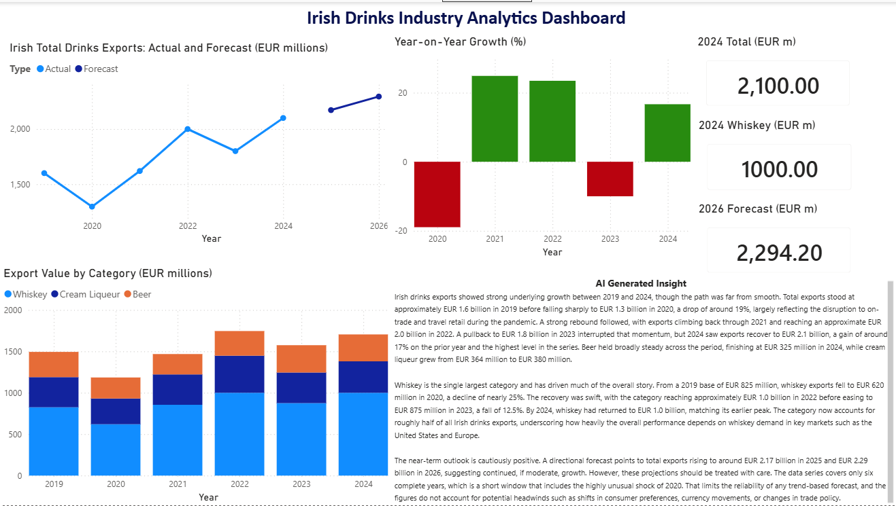

# Irish Drinks Industry Analytics Dashboard

An end to end analytics project on Ireland's drinks export industry (2019 to 2024), built with Python, a time series forecast, an AI-generated insight layer, and an interactive Power BI dashboard. Every figure is traced to an official Bord Bia source, and estimated figures are clearly separated from exact ones.

## What this project shows

- Sourcing and verifying real economic data from primary reports, not second-hand summaries.
- Cleaning and analysing the data in Python (pandas, matplotlib).
- Building a time series forecast and, importantly, being honest about its limits.
- Using the Anthropic API to turn the numbers into a plain-language business summary.
- Presenting the whole story in a Power BI dashboard.

## The story in the data

Irish drinks exports followed a clear pattern over six years: a solid 2019 baseline, a sharp COVID crash in 2020 (down about 19 percent), a strong recovery in 2021, a record peak in 2022 (approaching 2,000 million euro), a correction in 2023 (down about 8 percent as Bord Bia reported it), and a new record in 2024 (just over 2,100 million euro). Whiskey is the single largest category and drives most of the movement, accounting for roughly half of the three main categories.

## The dataset

All figures are in millions of euro. Source: Bord Bia Export Performance and Prospects reports, 2019-20 through 2024-25.

| Year | Total Drinks | Whiskey | Cream Liqueur | Beer | Total quality |
|------|-------------:|--------:|--------------:|-----:|:--------------|
| 2019 | 1,600.8 | 825 | 364 | 305 | Exact |
| 2020 | 1,297.3 | 620 | 311 | 254 | Exact |
| 2021 | 1,620.0 | 855 | 367 | 246 | Exact |
| 2022 | ~2,000 | ~1,000 | 448 | ~298 | Approximate |
| 2023 | 1,800.0 | 875 | 370 | 330 | Exact |
| 2024 | 2,100.0 | 1,000+ | 380 | 325 | Exact |

## Data provenance and honesty (please read)

This project treats data integrity as a feature, not an afterthought. Figures were verified by reading the primary Bord Bia PDFs directly.

- **Exact figures** (read straight from a primary report): the totals for 2019, 2020, 2021, 2023, and 2024, and most sub-categories.
- **Estimated figures** (clearly labelled): the 2019 sub-categories are derived by working backwards from the 2020 values and the stated percentage declines. The 2022 total is an official rounded figure (approaching 2,000 million euro). The 2022 beer figure is read from a chart only, with no exact number printed, so it is treated as an estimate.

### Data revisions handled

Bord Bia sometimes revises a prior year in a later report. This project keeps each year's own-report figure and notes the later revision, rather than silently mixing versions.

- The 2019 total was first published as about 1,450 million euro, then finalised at 1,600.8 million euro the following year.
- The 2020 total was published as 1,297.3 million, then revised up to 1,364.2 million in the next report. This project uses the originally published figure and notes the revision.
- The 2022 cream liqueur figure is 448 million as stated in the 2022-23 report of record. The following year's report implies about 407 million, an effective downward revision.

Because the dataset uses each year's own-report total, year on year growth calculated here can differ slightly from Bord Bia's headline percentages (for example, 2021 computes to about +25 percent here versus Bord Bia's headline +19 percent, which used a revised 2020 base). This difference is documented rather than hidden.

## Method

1. **Load and clean** the six year dataset in pandas, with a quality flag on each total.
2. **Explore** with line charts (total and whiskey trends), a year on year growth chart, and a category split.
3. **Forecast** 2025 and 2026 using Holt's linear trend method with damping. With only six annual points and no seasonality, full Holt-Winters is not appropriate, and the forecast is directional rather than precise. It projects continued growth (about 2,171 million in 2025 and 2,294 million in 2026) but cannot anticipate cyclical corrections like 2023.
4. **AI insight layer** using the Anthropic API (claude-sonnet-4-6). The model is given only the verified figures and is instructed not to invent numbers, to flag the approximate 2022 data, and to caveat the forecast.
5. **Dashboard** in Power BI Desktop, bringing the trends, growth, category split, forecast, and AI summary onto one page.

## Tools

Python (pandas, matplotlib, statsmodels), Google Colab, Anthropic API, Power BI Desktop, GitHub.

## Repository contents

- `irish_drinks_industry_analytics.ipynb` - the full analysis notebook.
- `irish_drinks_analysis.csv` - the combined actuals and forecast used by the dashboard.
- `irish_drinks_data.xlsx` - the raw verified dataset.
- `ai_insight_summary.txt` - the AI-generated business summary.
- `irish_drinks_dashboard.pbix` - the Power BI dashboard.
- `dashboard_screenshot.png` - a preview image of the dashboard.

## Sources

Bord Bia Export Performance and Prospects reports:

- 2019-2020: https://www.bordbia.ie/globalassets/bordbia2020/industry/insights/new-publications/performance-and-prospects-2019-2020.pdf
- 2020-2021: https://www.bordbia.ie/globalassets/bordbia2020/industry/insights/performance--prospects/bord-bia-export-performance--prospects-2020--2021-1.pdf
- 2021-2022: https://www.bordbia.ie/globalassets/performance-and-prospects/bord-bias-export-performance--prospects-2021---2022-pdf-report.pdf
- 2022-2023: https://www.bordbia.ie/globalassets/bordbia.ie/industry/2022---2023-export-performance--prospects-final.pdf
- 2023-2024: https://www.bordbia.ie/globalassets/bordbia.ie/industry/performance-and-prospects/bord-bia-exports-performance-and-prospects-report-2023---2024.pdf
- 2024-2025: https://www.bordbia.ie/globalassets/performance-and-prospects/bord-bia-export-performance-and-prospects-report-2024-2025.pdf

## Author

Asmita Bansode. Built as a portfolio project demonstrating the full analyst workflow from primary-source data to a published dashboard.
